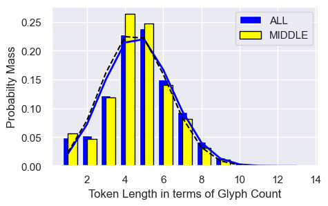
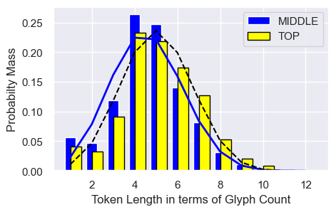
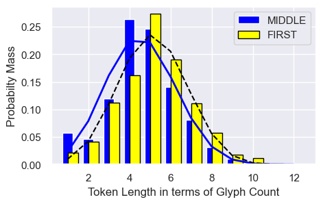
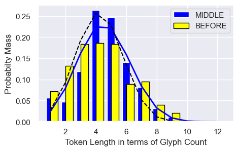
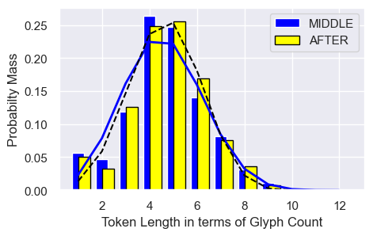
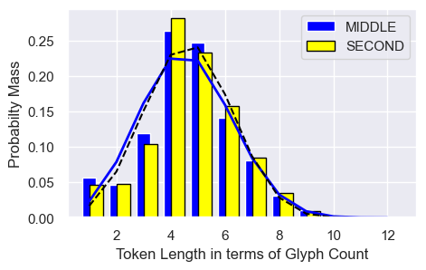
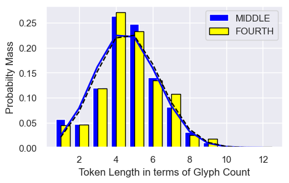

[Back to Table of Contents](README.md#Table-of-Contents)

# Additional Figures

<h3 align="center">Figure SOM.1. Token Length Mass Probability Functions  Comparison of ALL and MIDDLE Cohorts</h3>

    
<h3 align="center">Figure SOM.2. Token Length Mass Probability Functions  Comparison of MIDDLE and TOP Cohorts</h3>

<h3 align="center">Figure SOM.3. Token Length Mass Probability Functions  Comparison of MIDDLE and FIRST Cohorts</h3>

<h3 align="center">Figure SOM.4. Token Length Mass Probability Functions  Comparison of MIDDLE and BEFORE Cohorts</h3>

<h3 align="center">Figure SOM.5. Token Length Mass Probability Functions  Comparison of MIDDLE and AFTER Cohorts</h3>

<h3 align="center">Figure SOM.6. Token Length Mass Probability Functions  Comparison of MIDDLE and SECOND Cohorts</h3>

<h3 align="center">Figure SOM.7. Token Length Mass Probability Functions  Comparison of MIDDLE and FOURTH Cohorts</h3>

    
 

[Back to Table of Contents](README.md#Table-of-Contents)

